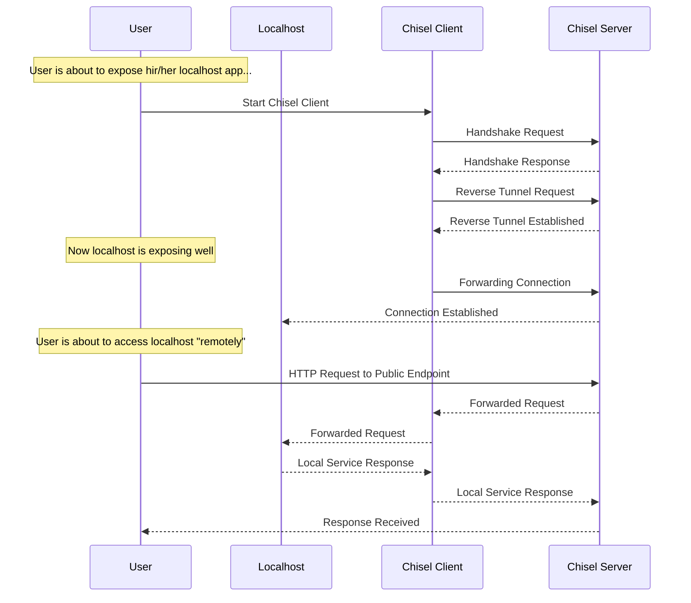
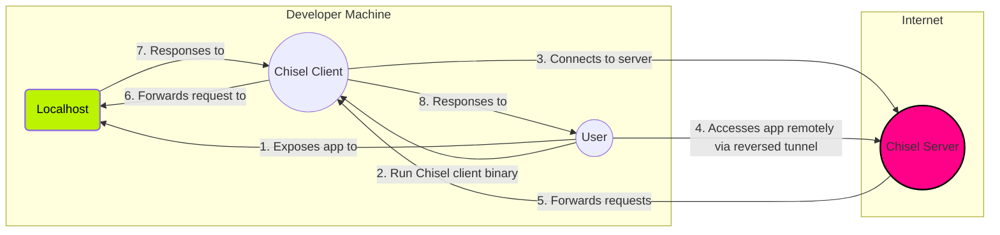

# 💥 Chisel + Hoppscotch
The Chisel + Hoppscotch stack is a powerful combination for securely exposing local apps to the internet and conducting API testing. This stack leverages the unique capabilities of these two tools to provide a comprehensive solution for developers and testers.

- **Chisel**: Secure, fast, performant
- **Hoppscotch**: Developer-friendly, lightweight, PWA-like

## ⚙️  How it works?

To better explain, let's start by illustrating how tunneling works using a sequence diagram. For this purpose, I will be using [Chisel](https://github.com/jpillora/chisel) tool.



Speaking specifically about the BunnyShell template example, which is more relevant to our discussion:


## ⚙️  Usage
See [Nginx Demo](../../../examples/nginx_demo/) example.

## 📄 License
This project is licensed under the [MIT License](../../../LICENSE).

---

```python
< 🏆 Happy BunnyShelling 🚀 >
-----------------------------
              \
               \   
               ((`\
            ___ \\ '--._
         .'`   `'    o  )
        /    \   '. __.'
       _|    /_  \ \_\_
      {_\______\-'\__\_\
```

