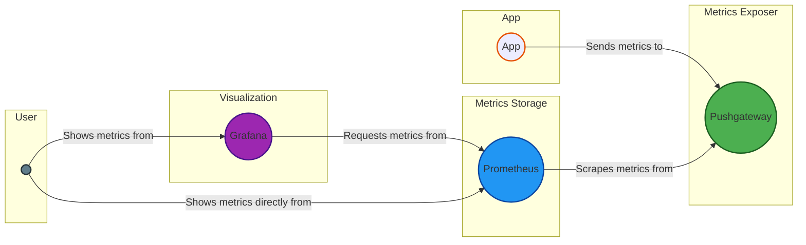

# 💥 Chisel
The **Prometheus + Pushgateway + Grafana** stack is a robust solution for monitoring, collecting, and visualizing metrics in real-time. This powerful combination of open-source tools enables you to gather, store, and analyze metrics from various sources.

- **Prometheus**: scalable, flexible, powerful
- **Pushgateway**: intermediary, batch-oriented, ephemeral
- **Grafana**: intuitive, customizable, interactive

## ⚙️  How it works?

## ⚙️  Usage
See [Process Memory Debugging](../../../examples/process_memory_debugging/) script example.

## 📄 License
This project is licensed under the [MIT License](../../../LICENSE).

---

🏆 Happy [BunnyShelling](https://bunnyshell.devpost.com/)! 🚀
