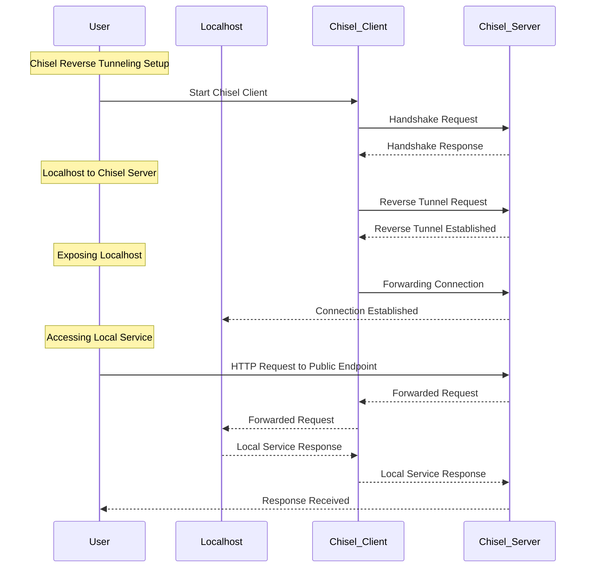

# 💥 Chisel
The Chisel + Hoppscotch stack is a powerful combination for securely exposing local apps to the internet and conducting API testing. This stack leverages the unique capabilities of these two tools to provide a comprehensive solution for developers and testers.

- **Chisel**: Secure, fast, performant
- **Hoppscotch**: Developer-friendly, lightweight, PWA-like

## ⚙️  How it works?

### Sequence Diagram

## ⚙️  Usage
See [Process Memory Debugging](../../../examples/process_memory_debugging/) script example.

## 📄 License
This project is licensed under the [MIT License](../../../LICENSE).

---

🏆 Happy [BunnyShelling](https://bunnyshell.devpost.com/)! 🚀
