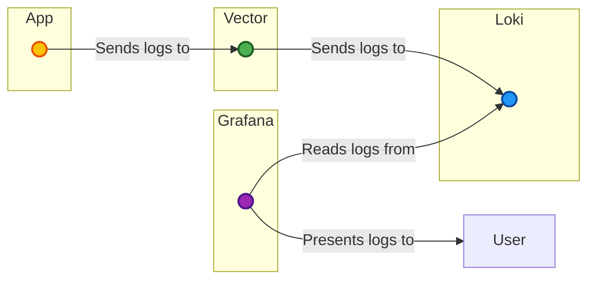

# Template Overview

```mermaid
graph LR

style A fill:#FFC107, stroke:#E65100, stroke-width:2px;
style B fill:#4CAF50, stroke:#1B5E20, stroke-width:2px;
style C fill:#2196F3, stroke:#0D47A1, stroke-width:2px;
style D fill:#9C27B0, stroke:#4A148C, stroke-width:2px;

subgraph App
    A(( ))
end

subgraph Vector
    B(( ))
end

subgraph Loki
    C(( ))
end

subgraph Grafana
    D(( ))
end

A -->|Sends logs to| B
B -->|Sends logs to| C
D -->|Reads logs from| C
D -->|Presents logs to| User
```
