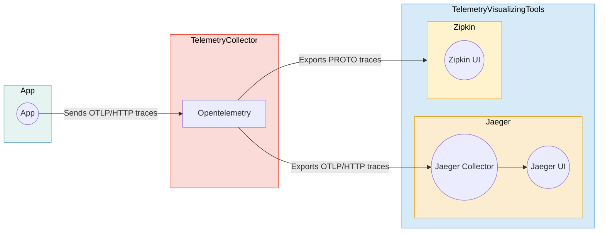

# 💥 Grafana + Vector + Loki

The **Grafana + Vector + Loki** stack is a powerful combination of open-source tools for log management, processing, and visualization. It offers a streamlined solution for collecting, processing, storing, and analyzing logs from various sources.

- **Vector**: fast, efficient, reliable
- **Grafana**: intuitive, customizable, interactive
- **Loki**: scalable, cost-effective, flexible

## ⚙️  How it works?



## ⚙️  Usage
See [User Registration](../../../examples/user_registration) example.

## 📄 License
This project is licensed under the [MIT License](../../../LICENSE).

---

```python
< 🏆 Happy BunnyShelling 🚀 >
-----------------------------
              \
               \   
                     /\    .-" /
                    /  ; .'  .' 
                   :   :/  .'   
                    \  ;-.'     
       .--""""--..__/     `.    
     .'           .'    `o  \   
    /                    `   ;  
   :                  \      :  
 .-;        -.         `.__.-'  
:  ;          \     ,   ;       
'._:           ;   :   (        
    \/  .__    ;    \   `-.     
     ;     "-,/_..--"`-..__)    
     '""--.._:`
```
