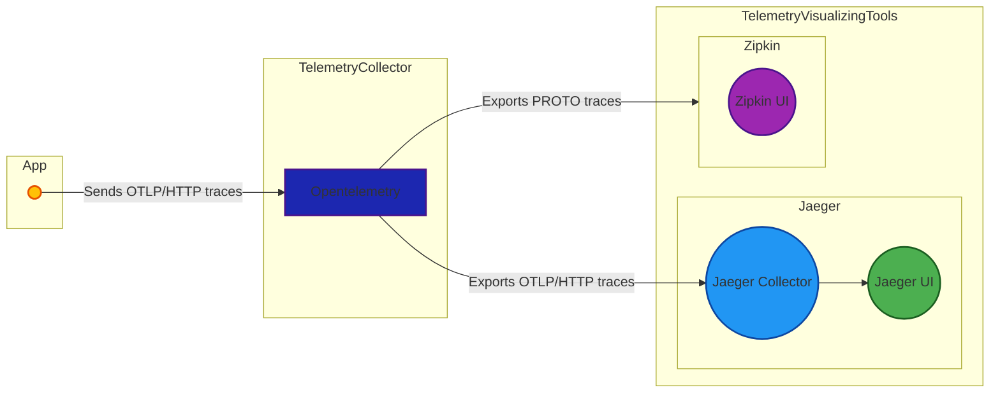

# 💥 Jaeger + Zipkin + OpenTelemetry

The Jaeger + Zipkin + OpenTelemetry stack is a comprehensive set of open-source tools for distributed tracing and observability. This stack offers powerful capabilities for tracing and troubleshooting complex systems.

**Jaeger**: distributed, scalable, end-to-end
**Zipkin**: lightweight, easy-to-use, interoperable
**OpenTelemetry**: standardized, extensible, cross-platform

## ⚙️  How it works?



## ⚙️  Usage
See [Fetch Customers](../../../examples/fetch_customers) example.

## 📄 License
This project is licensed under the [MIT License](../../../LICENSE).

---

```python
< 🏆 Happy BunnyShelling 🚀 >
-----------------------------
      \
       \   
           /\ /|
          |||| |
           \ | \
       _ _ /  @ @
     /    \   =>X<=
   /|      |   /
   \|     /__| |
     \_____\ \__\
```
