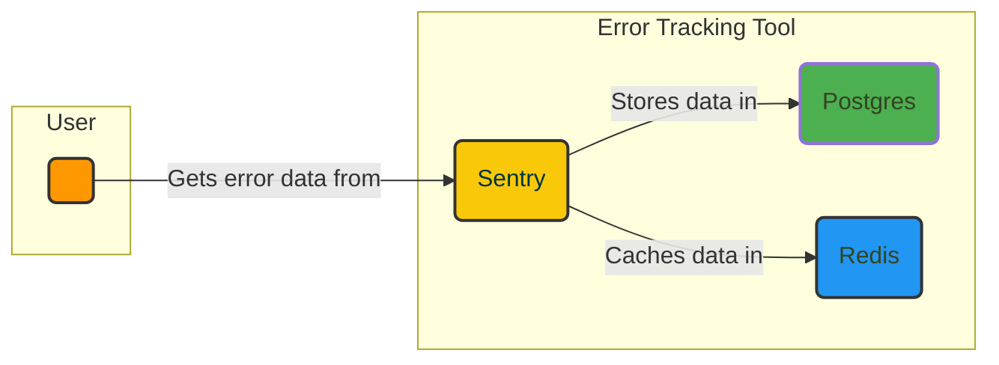

# 💥 Sentry + PostgreSQL + Redis

The Sentry + PostgreSQL + Redis stack utilizes Sentry as a top-notch error monitoring solution. With its real-time tracking and analysis capabilities, Sentry provides valuable insights and proactive notifications, allowing for effective issue identification, diagnosis, and resolution.

## ⚙️  How it works?

## 🚀 Project Approach & Potential Roadmap
I have intentionally utilized an older version of Sentry (9.1.2) due to its simplicity and minimalistic approach. Although newer versions offer more features, the self-hosted nature of Sentry introduces complexities in the form of a [docker-compose setup](https://github.com/getsentry/self-hosted/blob/master/docker-compose.yml) involving numerous intertwisted services. By opting for a leaner setup, I prioritize resource efficiency while ensuring the quality of error monitoring. This decision aligns with my preference for simplicity and a focus on the balance between efficiency and quality.

In the future roadmap, there is a possibility to upgrade to the newer version of Sentry. However, given the constraints of the hackathon mode and limited time available, it presents a challenging task to implement the newer version at this stage.

## ⚙️  Usage
See [Process Memory Debugging](../../../examples/file_processor/) script example.

## 📄 License
This project is licensed under the [MIT License](../../../LICENSE).

---

🏆 Happy [BunnyShelling](https://bunnyshell.devpost.com/)! 🚀
