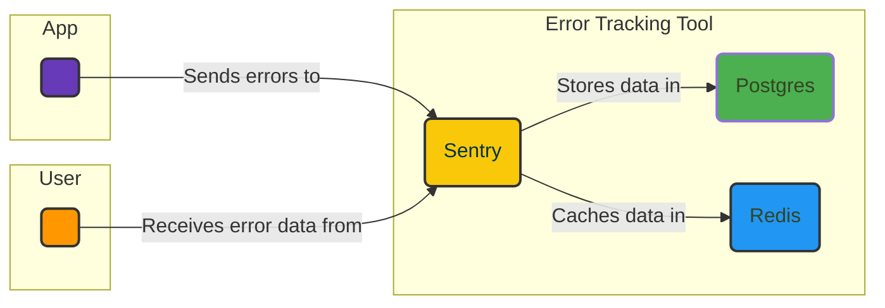

# 💥 Sentry + PostgreSQL + Redis

The Sentry + PostgreSQL + Redis stack utilizes Sentry as a top-notch error monitoring solution. With its real-time tracking and analysis capabilities, Sentry provides valuable insights and proactive notifications, allowing for effective issue identification, diagnosis, and resolution.

## ⚙️  How it works?



## 🚀 Project Approach & Potential Roadmap
I have deliberately chosen an older version of Sentry (9.1.2) due to its straightforwardness and minimalist approach. Although newer versions offer a wider range of features, the current self-hosted nature of Sentry introduces complexities in the form of a docker-compose setup involving [numerous interconnected services](https://github.com/getsentry/self-hosted/blob/master/docker-compose.yml). By opting for a more streamlined configuration, I prioritize resource efficiency while ensuring the quality of error monitoring. This decision aligns with my preference for simplicity and a focus on finding the right balance between efficiency and quality.

In the future roadmap, there is a possibility to upgrade to the latest version of Sentry. However, given the constraints of the hackathon mode and the limited time available, implementing the newer version at this stage presents a challenging task.

## 🔐 Credentials
The Sentry credentials are hardcoded into the database migration script:
```bash
admin@admin.local
admin
```

## ⚙️  Usage
See [File Processor](../../../examples/file_processor/) example.

## 📄 License
This project is licensed under the [MIT License](../../../LICENSE).

---

```python
< 🏆 Happy BunnyShelling 🚀 >
-----------------------------
  \
   \   

   ***       
  ** **
 **   **
 **   **         **** 
 **   **       **   ****
 **  **       *   **   **
  **  *      *  **  ***  **
   **  *    *  **     **  *
    ** **  ** **        **
    **   **  **
   *           *
  *             *
 *    0     0    *
 *   /   @   \   *
 *   \__/ \__/   *
   *     W     *
     **     **   
       *****
```
